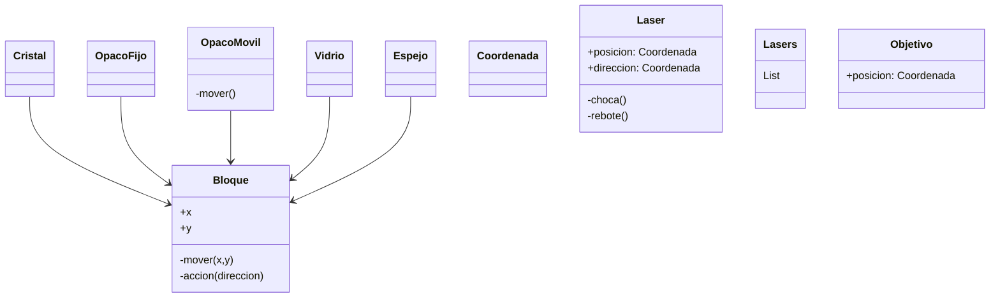
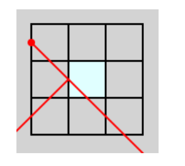
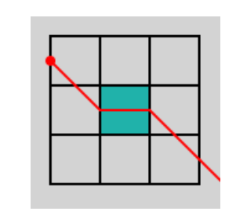
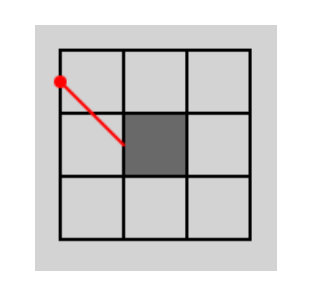
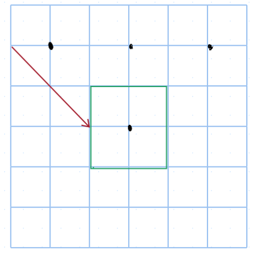
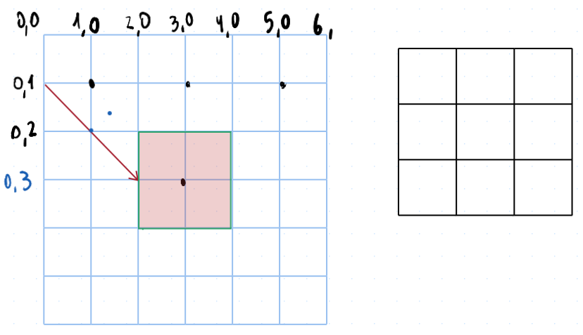

Deben estar bien separadas las clases relacionadas con la lógica y la interfaz gráfica, en 2 capas de abstracción.

Se debe utilizar polimorfismo para implementar los comportamientos de los disferentes bloques.

Agregar un diagrama de clases y/o secuencia en formato png o pdf. El diagrama debe incluir las clases principales de la
capa lógica.

Opcionalmente, acompañar el diagrama con un informe explicando y justificando las decisiones de diseño tomadas.



```
laser.xInicio
laser.yInicio
laser.xFin
laser.yFin
laser.dir #(dirx, diry)

def mover():
	laser.xFin = laser.xInicio
	laser.yFin = laser.yInicio
for _ in range(3):
	laser.xFin += 1
	laser.yFin += 1
	# Cada vez que se mueva un bloque, cada laser debe volver a fijarse sumando progresivamente
	# si se choca o no
```




haciendo clicks

mover()
Puede mover solo si hace el click bien, sino no hace nada.


