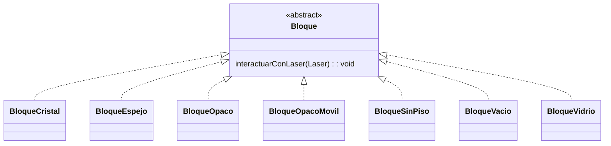
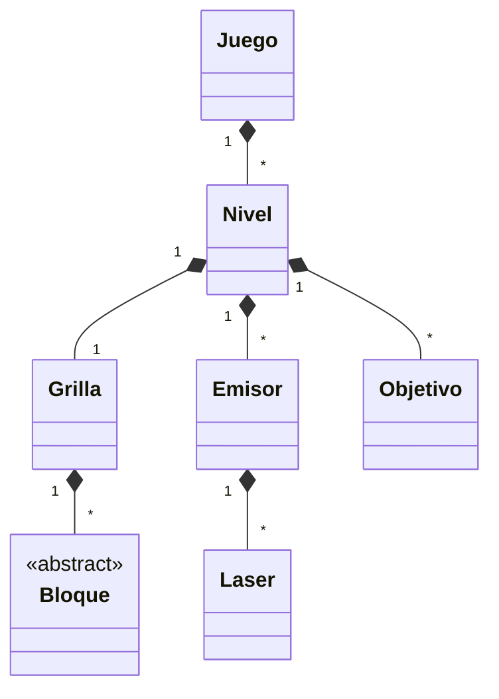

# TP1 Lasers Paradigma
Trabajo practico 1 de la materia Paradigmas de la programación (TB025)

# INTEGRANTES
 - Alan Richmond, padron: 106783
 - Mauricio Uribe, padron: 105971

# Diagrama bloques

# Diagrama general
