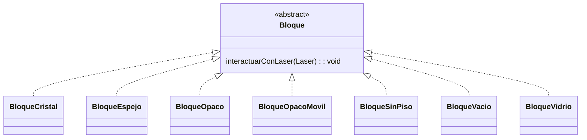
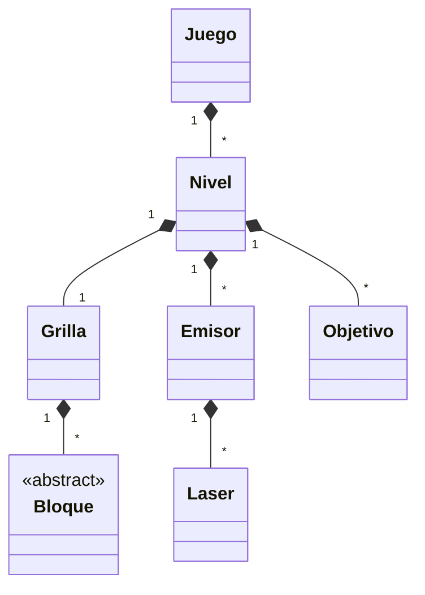

# Framework used: JavaFX, following View-Controller-Model and Object Oriented Programming principles and best practices.

## Purpose

This project has the sole purpose of applying and following best practices/principles from Object Oriented Programming paradigm and uses JavaFX framework to pair a `view` with the `model`. The pattern used is with JavaFX is MVC (model view controller).

**The view was not a priority for this project** although it intends to be playable.

## Usage

The application can be run with JavaFX as shown in the video. It is not terminal-ready as it was a small assignment.

## Playthrough
https://www.youtube.com/watch?v=A0D8MAsXxVA

## Rules:

- Lasers is a puzzle-style game that progresses in turns until the player finds the solution to the problem.
- At any time, the user can choose any level from a list of available levels.
- The game takes place on a two-dimensional grid.
- According to each level's configuration, the following elements are arranged on the grid:
- Laser emitter: Can only be placed on the edge between two cells, or on the edge of the grid (i.e., never in a corner or in the center of a cell). The beam is emitted in one of 4 possible diagonal directions.
- Objective: Can only be placed on the edge between two cells, or on the edge of the grid.
- Floor: Occupies a cell. Allows the cell to contain a Block.
- Block: Can only be placed on a cell that contains a Floor. There are different types of blocks:
  	- Fixed opaque block: Absorbs laser beams. Cannot be moved.
	- Movable opaque block: Absorbs laser beams.
  	- Mirror block: Reflects laser beams.
  	- Glass block: When hit by a beam, the beam is diffracted into 2.
  	- Crystal block: When hit by a beam, the beam is refracted.
In each turn, the player can move a Block (that isn't fixed) to any cell that is free (and has a Floor).* The level is completed when all Objectives are reached by at least one laser beam.

## Blocks diagram

## General diagram

